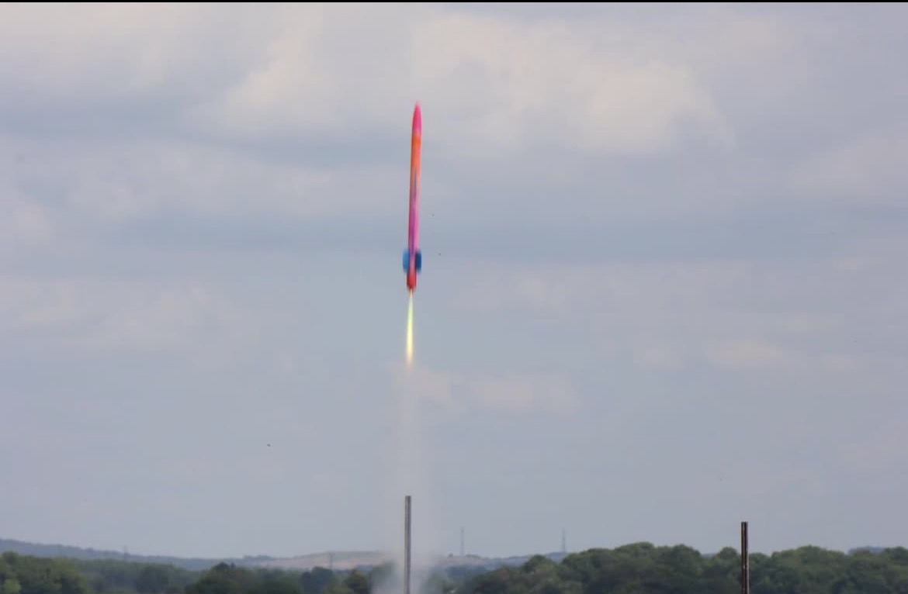

# ARCS Rocket Avionics System & Flight Computer

Custom-designed, multi-sensor flight computer and high-g avionics bay built for the UK ARCS National Rocketry Competition. Led a 4-person avionics sub-team through complete system lifecycle: prototyping, PCB layout, firmware development, mechanical structural integration, and post-flight failure analysis.
<table border="0">
  <tr>
    <td width="50%" align="center">
      
       
      <b>CAD Assembly</b> — Avionics bay & hardware stack
    </td>
    <td width="50%" align="center">
      
       
      <b>Flight Test</b> — Rocket launch in action
    </td>
  </tr>
</table>

---

## Technical Specifications
* **Microcontroller:** ESP32 (3.3V logic)
* **Sensors:** BMP390 Barometric Altimeter (I2C), MPU6050 6-Axis IMU (I2C), u-blox M10 GNSS Module
* **Data Storage:** MicroSD SPI Module logging at 100 Hz
* **Telemetry:** ExpressLRS (ELRS) 2.4GHz RF Link with independent 1S battery backup
* **Power Architecture:** 2S LiPo (8.4V nominal) stepped down via high-efficiency 3.3V switching buck regulator
* **Airframe Diameter Envelope:** <40 mm ID

---

## Key Hardware & Software Accomplishments

### 1. Custom 2-Layer PCB Design (KiCad)
* Designed a custom 2-layer FR4 board featuring dedicated ground planes to isolate sensitive I2C sensor traces from power supply EMI.
* Optimised trace routing and space efficiency to meet 40mm diameter envelope.
* Replaced low-vibration-tolerant Mini Tamiya power connectors with high-reliability XT30 connectors.

### 2. Mechanical Integration & Structural DFAM
* Designed a 3D-printed PETG sled featuring embedded brass heat-set inserts for secure, repeatable PCB mounting.
* Ran continuous M3 stainless steel load-bearing rods with Nyloc nuts through the sled assembly to absorb longitudinal shock forces during parachute deployment and ground impact.
* Designed battery mounting solution into the sled and added insert holes for live telemetry and LCD circuit.

### 3. Data Pipeline & Telemetry
* Developed C++ firmware for high-rate sensor sampling and continuous CSV write protocols.
* Created a Python script to push log data automatically into a MySQL database for MATLAB post-flight analysis and trajectory simulation.

---

## Flight Outcome & Crash Survivability Test
During competition testing, the vehicle achieved a measured apogee of 411 m. Due to a mechanical recovery wadding jam, the airframe failed to separate, resulting in an un-deployed ballistic descent hitting the ground at **80 m/s (~180 mph)**.

* **Result:** While the outer airframe and nosecone suffered heavy structural failure, the internal PETG sled and load-bearing steel rods fully protected the internal electronics.
* **Data Status:** The PCB remained intact, powered on, and actively logging. **100% of flight log data was recovered uncorrupted.**
<table border="0">
  <tr>
    <td width="50%" align="center">
      
       
      <b>Altitude vs Time </b> — Graph shows 80m/s impact.
    </td>
    <td width="50%" align="center">
      
       
      <b>Temperature vs Time</b> — Graph shows internal temperature spike when avionics powers on.
    </td>
  </tr>
</table>
---

## Repository Contents
* `/documentation/` - Formal milestone review PDFs (Critical Design Review, Manufacturing & Testing Review, Flight Readiness Review, Post-Flight Analysis).
* `/hardware/` - KiCad schematics, board layouts, Gerber files, and Full Avionics CAD Assembly (STEP).
* `/firmware/` - ESP32 C++ flight code, MATLAB scripts, raw sensor data csv and MATLAB plots.
* `/media/` - Hardware photos, PCB assembly images, Launch day photos, and post-flight recovery photos.
